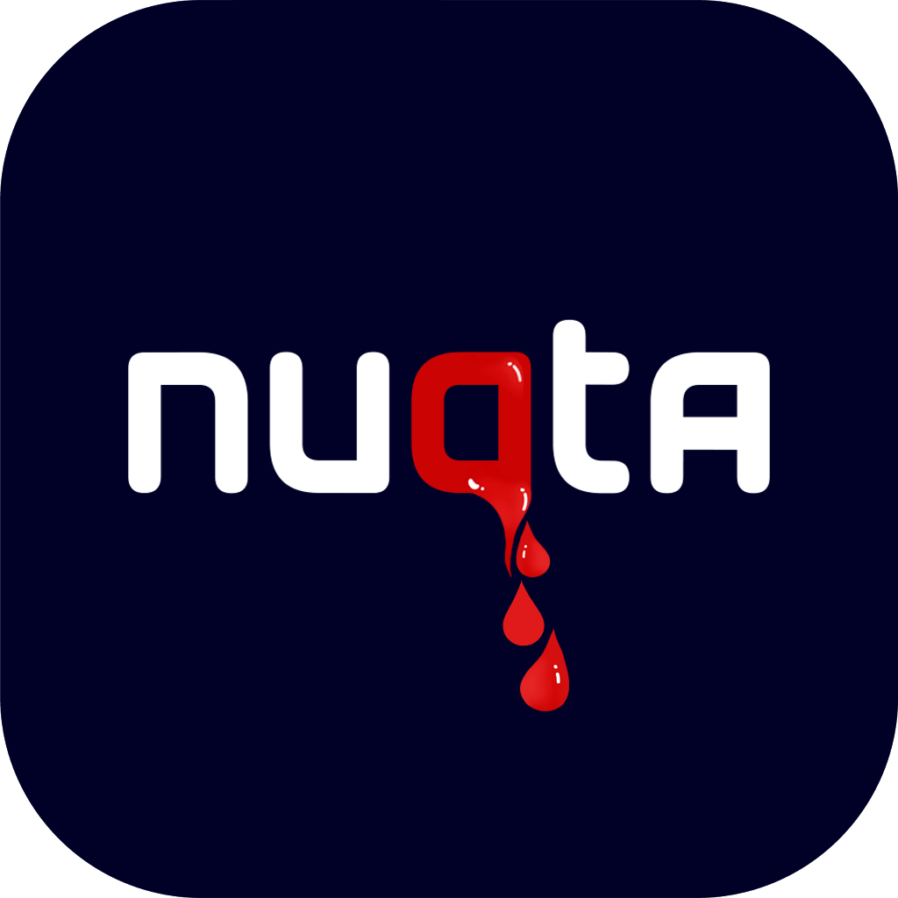
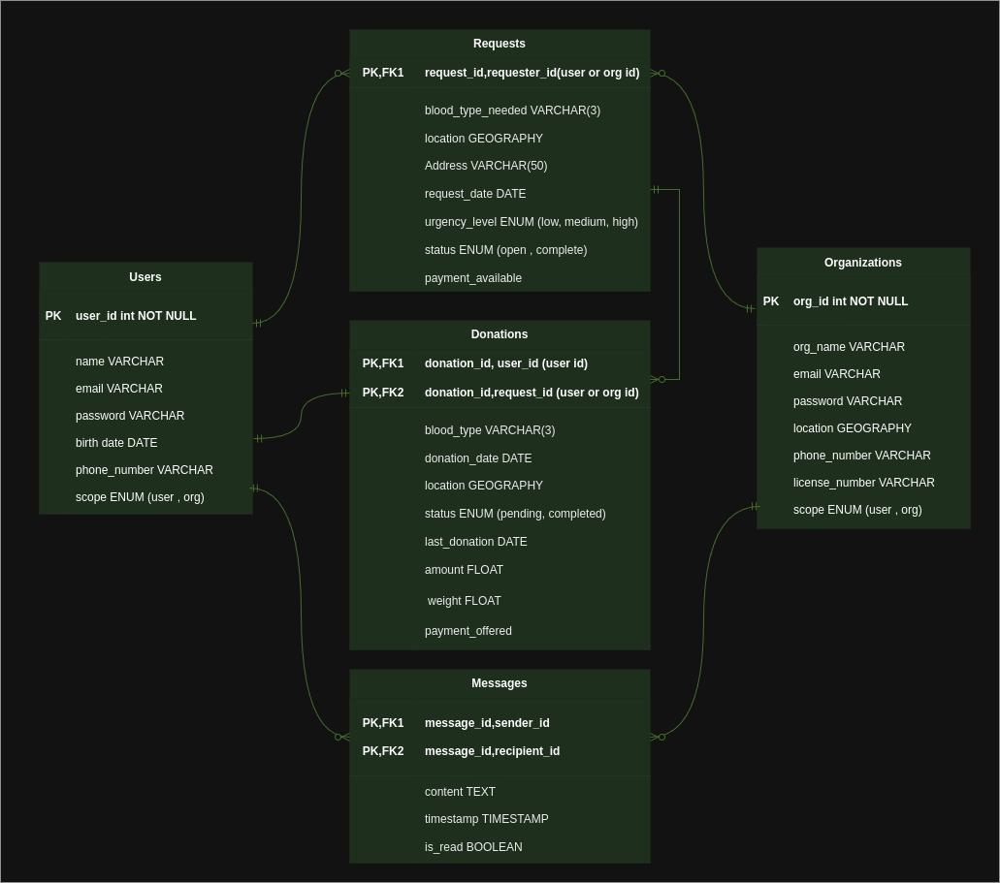

# Nuqta



---

## Overview

The **Blood Donation App** is a Spring Boot-based application designed to connect blood donors and recipients in real
time. By leveraging location services, users can easily find nearby individuals with matching blood types. The app
fosters a community of voluntary and paid blood donors, ensuring a seamless and safe donation process.

To enhance safety, the app employs machine learning (ML) algorithms to assess the health suitability of donors, ensuring
they meet the required criteria. This reduces risks and ensures a smooth experience for both donors and recipients.

---

## Class Diagram



## Features

### Core Functionalities

- **Real-time Location Services**: Use geographical data to connect donors and recipients within a specific radius.
- **Blood Type Matching**: Simplify the search by matching blood types.
- **Payment Options**: Choose between voluntary or paid donations.
- **Machine Learning Health Assessments**: Verify donor health eligibility using trained ML models.

### User Authentication and Security

- **Sign-Up and Sign-In**: Securely register and log in using JWT-based authentication.
- **Email Verification**: Verify user email addresses to ensure legitimacy.
- **Phone Number Verification**: Integrate Twilio for SMS-based phone number verification.

### Additional Features

- **Request Management**: Users can post and track blood donation requests.
- **Donation History**: Track and manage donation records.

---

## Tech Stack

- **Backend Framework**: Spring Boot 3.4.1
- **Authentication**: Spring Security with JWT for token-based security.
- **Mapping**: MapStruct for DTO and entity mapping.
- **Testing**: JUnit for unit and integration testing.
- **Location Services**: GEOGRAPHY data type for storing and querying locations.
- **SMS Integration**: Twilio for phone number verification.
- **Database**: PostgreSQL (or compatible relational database).
- **Machine Learning**: Pre-trained models for health assessments.

---

## System Requirements

- **Java**: JDK 17 or later.
- **Database**: PostgreSQL (or compatible relational database).
- **Build Tool**: Maven 3.8+.

---

## Installation and Setup

### Prerequisites

1. Install **JDK 17** or later.
2. Set up a **PostgreSQL** database.
3. Install **Maven 3.8+**.

### Steps

1. Clone the repository:
   ```bash
   git clone <repository-url>
   cd blood-donation-app
   ```
2. Configure the `application.properties` file:
   Update the file with your database credentials, Twilio API keys, and JWT secret.
   ```properties
   spring.datasource.url=jdbc:postgresql://localhost:5432/blood_donation
   spring.datasource.username=<db_username>
   spring.datasource.password=<db_password>
   jwt.secret=<your_jwt_secret>
   twilio.account-sid=<your_twilio_account_sid>
   twilio.auth-token=<your_twilio_auth_token>
   twilio.phone-number=<your_twilio_phone_number>
   ```
3. Build the application:
   ```bash
   mvn clean install
   ```
4. Run the application:
   ```bash
   java -jar target/blood-donation-app.jar
   ```

---

## API Documentation

The API endpoints are documented using **Postman**. You can access the API documentation here:  
[Postman API Documentation](https://documenter.getpostman.com/view/36966051/2sAYQiA7Wq)

### Key Endpoints

#### Authentication

- **POST /auth/sign-up**: Register a new user.
- **POST /auth/sign-in**: Log in and receive a JWT token.
- **POST /auth/verify-email**: Verify email address.
- **POST /auth/verify-phone**: Verify phone number via Twilio.

#### Blood Requests

- **GET /requests**: Retrieve all requests.
- **POST /requests**: Create a new blood request.
- **PUT /requests/{id}**: Update an existing request.
- **DELETE /requests/{id}**: Delete a request.

#### Donations

- **GET /donations**: Retrieve all donations.

---

## Machine Learning Integration

The application integrates pre-trained ML models to assess donor health based on the `Health Assessments` table. These
models predict a `health_score`, which determines donor eligibility.

### ML Features

- **Model Type**: Classification and regression.
- **Input Data**: User's health assessment records.

---

## Testing

### Unit and Integration Tests

JUnit is used to validate the application's functionality.

- Run all tests:
  ```bash
  mvn test
  ```
- Coverage includes:
    - Authentication (JWT Sign-In/Sign-Up).
    - Email and phone verification.
    - CRUD operations for blood requests and donations.

---

## Deployment

### Local Deployment

- Follow the installation steps above to run the application locally.

### Production Deployment

- Configure an external PostgreSQL database.
- Set up a cloud service (AWS, Azure, GCP) for hosting.
- Use environment variables for sensitive data (e.g., database credentials, API keys).

---

## Contributing

We welcome contributions! Here’s how you can contribute:

1. Fork the repository.
2. Create a feature branch:
   ```bash
   git checkout -b feature/<feature-name>
   ```
3. Commit your changes:
   ```bash
   git add .
   git commit -m "Add new feature"
   git push origin feature/<feature-name>
   ```
4. Open a pull request.

---

## Contact

For inquiries, contact the development team at [abdelrahmanmagdi527@gmail.com](mailto:abdelrahmanmagdi527@gmail.com).

---

## Acknowledgments

- **Spring Boot** for providing a robust backend framework.
- **Spring Security JWT** for make app security.
- **PostgreSQL** for reliable database management.
- **JUnit** for comprehensive testing support.
- **Mail** for send email verify.
- **Twilio** for enabling SMS-based phone verification.
- **Lombok** for reduced boilerplate code.
- **MapStruct** for Java bean mapping.
- **Swagger** for OpenAPI documentation.

---

Thank you for using the **Blood Donation App**! Your contributions can help save lives. 🩸